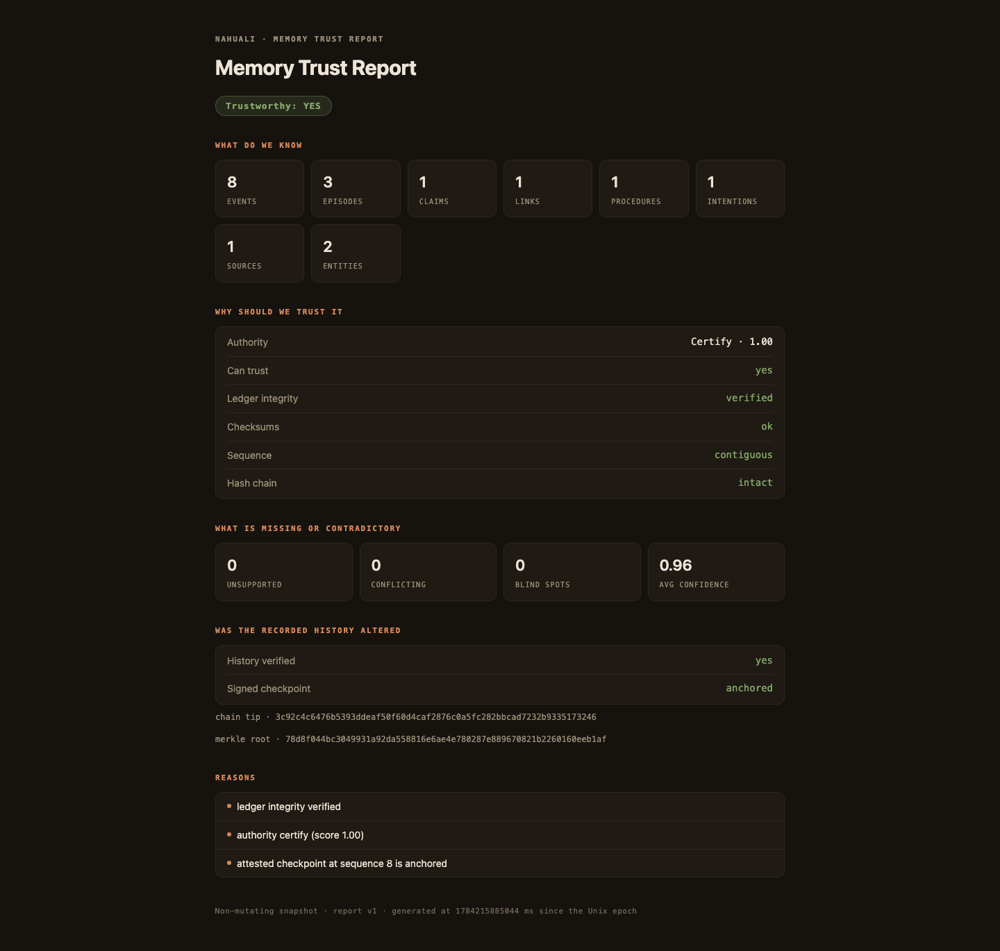
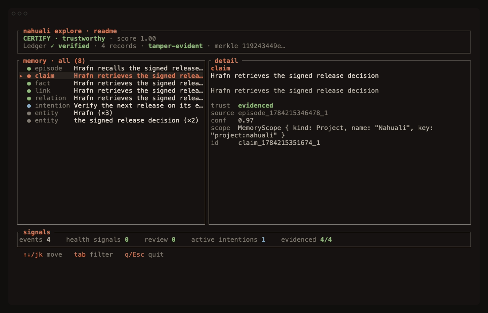
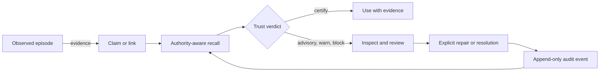

<p align="center">
  
</p>

# Nahuali

**The trust layer for agent memory.** Nahuali shows what a memory is based on,
whether it is safe to use, and when an agent should refuse it.

<p align="center">
  <a href="https://github.com/Arakiss/nahuali/actions/workflows/ci.yml"></a>
  <a href="https://codecov.io/gh/Arakiss/nahuali"></a>
  <a href="https://github.com/Arakiss/nahuali/releases"></a>
  <a href="LICENSE"></a>
  <a href="Cargo.toml"></a>
  
  <a href="https://registry.modelcontextprotocol.io/v0.1/servers?search=io.github.Arakiss%2Fnahuali"></a>
  
  <a href="RELEASE_VERIFICATION.md"></a>
  <a href=".github/workflows/sbom.yml"></a>
  <a href="TRUST_MODEL.md"></a>
</p>

Most memory systems optimize for finding relevant context. Nahuali asks the
question that comes next: **should the agent trust what it found?**

It records observations, claims, relationships, procedures, and intentions in
an append-only ledger. Recall can return the supporting evidence and a
deterministic trust verdict. Self-inspection finds unsupported, stale, or
contradictory memory without silently rewriting it. The default ledger is hash
chained, and an operator can sign its tip to detect a fully rewritten history.

Nahuali is local-first, source-available, and in public beta.

<p align="center">
  
</p>

<p align="center"><sub>A real <code>nahuali trust-report --attestation</code> generated from the checked-in synthetic source note: 8 ledger events, a verified hash chain, evidence-backed memory, and an anchored signed checkpoint. Open the <a href="examples/sample-trust-report.html">self-contained HTML receipt</a>.</sub></p>

## Quickstart

Install the signed macOS or Linux binaries:

```bash
curl -fsSL https://raw.githubusercontent.com/Arakiss/nahuali/main/scripts/install.sh | sh
export PATH="$HOME/.nahuali/bin:$PATH"
```

Record an observation, derive a claim from it, and inspect the result:

```bash
nahuali remember "Lena owns the release notes" --mention Lena --tag product
nahuali claim Lena owns "release notes" --source-last --confidence 0.92
nahuali recall "Who owns the release notes?" --authority --json
nahuali self-inspect --json
```

This is real persistent memory. The default store lives under
`~/.nahuali/data`, survives process restarts, and needs no Docker, database
server, model, account, or API key. Set `NAHUALI_DB_URL` when you want a shared
remote SurrealDB deployment instead.

After upgrading Nahuali, restart any application that keeps `nahuali-mcp`
running. This ensures the CLI and the long-lived MCP server open the embedded
store with the same engine version.

## Watch the trust decision change

For a narrated integrity example with no writes, run:

```bash
nahuali demo
```

That command explains the hash chain and signed checkpoint without changing
your store. The end-to-end demo below is a separate, reproducible product flow.
From a source checkout, run `scripts/run-launch-demo.sh verify`. It creates a
disposable store, follows it through the CLI, TUI, and a real MCP tool call, then
asserts the expected results.

An evidence-backed claim can drive action. A competing unsourced claim is
retained but blocks action, and self-inspection explains the contradiction
without silently rewriting the ledger.

<p align="center">
  
</p>

<p align="center"><sub>The animation runs the public CLI and MCP server against a disposable store. Reproduce it with <code>vhs assets/nahuali-launch-demo.tape</code>; verify the underlying assertions with <code>scripts/run-launch-demo.sh verify</code>.</sub></p>

## What ships today

| Capability | Shipped behavior | Proof |
|---|---|---|
| Evidence-backed recall | Every result can carry its source episode and its own deterministic trust verdict | `nahuali recall --require-evidence --authority --json` |
| Tamper evidence | Checksums, contiguous sequence, hash chain, Merkle root, and optional Ed25519 checkpoint | `nahuali validate`, `nahuali attest-sign`, `nahuali trust-report` |
| Governed self-inspection | Unsupported, stale, contradictory, and isolated memory becomes review work; inspection never rewrites history | `nahuali inspect`, `nahuali self-inspect`, `nahuali review` |
| Atomic authoritative writes | Multi-event operations either append their full ledger batch or append nothing; projection failure is reported separately after commit | Core and public API regression suites |
| Rebuildable derived tiers | Graph rows and semantic vectors are checked against the authoritative ledger and can be rebuilt | `projection-validate`, `semantic-status`, `semantic-rebuild` |
| Operational recovery | Restore rebuilds and validates the graph; `--rebuild-semantic` can return a store that is ready to serve in one operation | `nahuali restore --rebuild-semantic` |
| Agent integrations | Native CLI, stdio MCP server, local HTTP API, OpenAPI contract, and OCI MCP image | Interface documentation below |

## Why this is different

| Memory failure | Nahuali response |
|---|---|
| A relevant claim has no source | Return it as unsafe, not as a trusted fact |
| Good and weak memories are mixed together | Give each result its own evidence and verdict |
| Claims conflict or become stale | Surface the affected records for explicit review |
| A model proposes a repair | Validate the evidence and append an audited repair event |
| A historical record is edited | Break the ledger chain at the next record |
| The history is rewritten and re-chained | Refuse the old operator-signed checkpoint |

The four trust modes are deterministic:

- `certify`: the available checks support using the result.
- `advisory`: useful as a lead, but not safe to state without qualification.
- `warn`: evidence or health problems require verification.
- `block`: the result must not drive action until the conflict is resolved.

A verdict does not prove that remembered content is true. It makes the reason
for trust inspectable: evidence, provenance, confidence, freshness,
contradictions, and ledger integrity. The exact guarantees and limits live in
the [trust model](TRUST_MODEL.md).

## Inspect the memory directly

<p align="center">
  
</p>

<p align="center"><sub><code>nahuali explore</code> on the current build. The selected claim links to its source episode; the list includes the projected claim, fact, link, relation, intention, and entities that were missing from the older capture. Reproduce the exact disposable-store capture with <code>vhs assets/nahuali-tui.tape</code>.</sub></p>

## Use it from an agent

Nahuali ships a stdio MCP server with tools for capture, recall, inspection,
review, repair, intentions, backup, and ledger verification.

Run `nahuali init` to install the bundled skill where supported and print a
native-binary MCP configuration. The server is also published as
`io.github.Arakiss/nahuali` in the official MCP Registry and as an OCI image:

```json
{
  "mcpServers": {
    "nahuali": {
      "command": "docker",
      "args": [
        "run", "--rm", "-i",
        "-v", "nahuali-data:/data",
        "ghcr.io/arakiss/nahuali-mcp:latest"
      ]
    }
  }
}
```

The named volume keeps memory across container restarts. See
[MCP onboarding](crates/nahuali-mcp/ONBOARDING.md) for native and container
configurations.

## The trust loop



The deterministic core never calls an LLM. A model may propose a repair, but
the engine classifies, gates, and records it. Contradictions are never silently
overwritten.

## Interfaces

| Interface | Purpose | Reference |
|---|---|---|
| `nahuali` | Local workflow for agents, operators, audits, backup, and migration | [CLI](crates/nahuali-cli/README.md) |
| `nahuali-mcp` | Structured tools and resources for MCP clients | [MCP](crates/nahuali-mcp/README.md) |
| `nahuali-api` | Local HTTP integrations with an OpenAPI contract | [HTTP API](crates/nahuali-api/README.md) |
| `nahuali-core` | Deterministic Rust engine and public data contracts | [Core](crates/nahuali-core/README.md) |

The local HTTP API is unauthenticated. Do not expose it to an untrusted
network. Nahuali does not currently provide accounts, hosted sync, billing, or
a managed control plane.

The API exposes process liveness at `/v1/health` and serving readiness at
`/v1/ready`. Readiness verifies the ledger and graph and can require an exact,
current semantic index with `nahuali-api --require-semantic`. It returns `503`
until the configured tiers are ready, handles `SIGTERM` gracefully, and logs
method, path, status, and duration without query strings or request bodies.

## Storage

SurrealDB's `memory_record` table is the source of truth. Current memory, graph
tables, snapshots, and semantic vectors are derived and rebuildable.

- Embedded SurrealKV is the zero-service default.
- A remote SurrealDB endpoint supports shared deployments.
- Qdrant is optional and used only for semantic recall.
- Deterministic lexical recall works without Qdrant or a model.
- `reconcile` verifies the ledger and rebuilds derived data.
- `semantic-status` compares expected ledger-derived payloads with Qdrant and
  reports missing, orphaned, and stale points instead of trusting row counts.
- Backup and restore operate on the authoritative record ledger. Restore always
  rebuilds and validates the graph; `--rebuild-semantic` also rebuilds Qdrant
  and reports whether the restored store is operationally ready.

The embedded store has one process owner. A long-running MCP or HTTP server owns
the local store while it is active; a second process fails clearly instead of
waiting or risking concurrent writes. Use remote SurrealDB when several
independent processes need the same memory.

## Reproducible evidence

The [governance benchmark suite](GOVERNANCE_BENCHMARKS.md) tests provenance
coverage, contradiction and staleness detection, trust-verdict calibration,
ledger tampering, and attestation recovery against checked-in fixtures.

The vendor-neutral [Agent Memory Trust Benchmark](benchmarks/agent-memory-trust/README.md)
defines an adapter contract for comparing these capabilities across memory
systems. It reports each capability separately and keeps failures and
unsupported controls visible.

The first-party [Agent Memory Retrieval Benchmark](benchmarks/agent-memory-retrieval/README.md)
runs the shipped CLI against a versioned 24-memory, 12-query corpus. Its first
development baseline is bound to the corpus digest, binary SHA-256, and source
revision:

| Mode | Recall@1 | Recall@3 | MRR | nDCG@10 | Median | p95 |
|---|---:|---:|---:|---:|---:|---:|
| Lexical | 1.000 | 1.000 | 1.000 | 1.000 | 36.6 ms | 57.2 ms |
| Deterministic hybrid | 1.000 | 1.000 | 1.000 | 1.000 | 119.4 ms | 439.4 ms |

This small corpus is a regression gate, not a state-of-the-art claim and not a
substitute for LoCoMo or LongMemEval. The checked-in
[result](benchmarks/agent-memory-retrieval/results/nahuali-0.8.0-beta.5-dev.json)
contains every ranked item and latency sample; the scorer recomputes the metrics
and rejects drift or omitted required modes.

The release gate also exercises operational properties that unit tests cannot
establish alone:

- unchanged-ledger refresh at 1,000 and 10,000 events, with a 25 ms p95 budget;
- exact semantic freshness against Qdrant payloads;
- a published N-1 release binary, verified by checksum, Sigstore identity, and
  GitHub artifact attestation, writing a ledger that the current binary must
  open, recall, extend, back up, and restore;
- install, CLI/MCP coexistence, migration, backup drills, release assets, SBOM,
  provenance, and signed-release verification.

Run Nahuali's release gate:

```bash
bash scripts/verify-governance-benchmarks.sh
bash scripts/verify-retrieval-benchmark.sh
bash scripts/verify-release-upgrade.sh
bash scripts/verify-controlled-beta.sh
NAHUALI_VERIFY_GITHUB_SETTINGS=1 bash scripts/security-supply-chain-check.sh
```

## Beta limits

- APIs and storage behavior may still change before 1.0.
- Self-inspection proposes work but never writes automatically.
- Evidence proves traceability, not factual truth.
- The operator must retain a trusted signed checkpoint to detect rollback or a
  fully re-chained history.
- Scope labels separate memory contexts but are not access-control boundaries.
- Semantic recall requires an optional Qdrant service; the default lexical path
  does not.

Read [BETA.md](BETA.md) before using irreplaceable data.

## Build from source

```bash
cargo build --workspace
cargo test --workspace
cargo install --path crates/nahuali-cli --locked
cargo install --path crates/nahuali-mcp --locked
cargo install --path crates/nahuali-api --locked
```

Docker is only needed for the optional remote development stack and Qdrant:

```bash
docker compose up -d
```

## More documentation

- [Trust model](TRUST_MODEL.md)
- [Release verification](RELEASE_VERIFICATION.md)
- [Self-repair contract](SELF_REPAIR.md)
- [Governance benchmarks](GOVERNANCE_BENCHMARKS.md)
- [Security policy](SECURITY.md)
- [Contributing](CONTRIBUTING.md)

Questions, use cases, and design feedback belong in
[GitHub Discussions](https://github.com/Arakiss/nahuali/discussions). Bugs and
benchmark contributions have structured [issue templates](https://github.com/Arakiss/nahuali/issues/new/choose).

## License

Nahuali uses the [Functional Source License 1.1 with an MIT future grant](LICENSE).
Each release converts to MIT two years after its release date.
