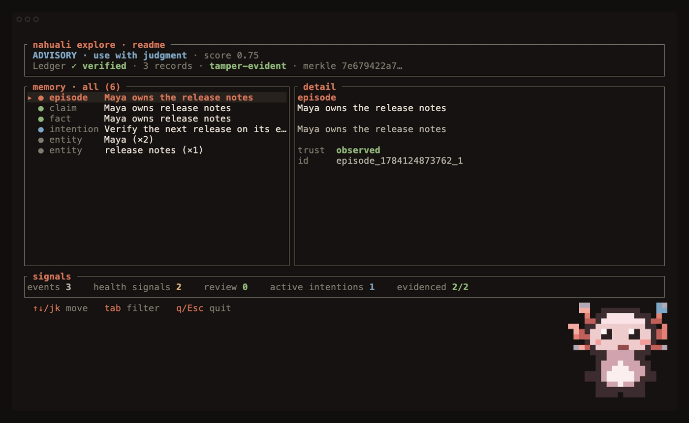

# Nahuali

**Memory an agent can inspect before it trusts.**

<p align="center">
  
</p>

<p align="center"><sub>From an empty memory to evidence-backed recall: Nahuali shows what is ready to use and pauses what still needs review.</sub></p>

<p align="center">
  <a href="https://github.com/Arakiss/nahuali/actions/workflows/ci.yml"></a>
  <a href="https://github.com/Arakiss/nahuali/releases"></a>
  <a href="RELEASE_VERIFICATION.md"></a>
  <a href="LICENSE"></a>
</p>

Most memory systems answer *what context looks relevant?* Nahuali also answers:

- What observation supports this memory?
- What conflicts with it or makes it stale?
- Has the recorded history changed?
- Is this safe for an agent to use now?

The result is a local-first memory engine with deterministic trust verdicts,
protected history, and portable evidence. Its core does not need a
model, account, API key, hosted service, or Docker.

## A 60-second tour

Install the signed macOS or Linux binary:

```bash
curl -fsSL https://raw.githubusercontent.com/Arakiss/nahuali/main/scripts/install.sh | sh
export PATH="$HOME/.nahuali/bin:$PATH"
```

Run `nahuali --version` in a terminal to see the real axolotl spritesheet come
alive beside the build identity. When the command is captured or redirected, it
emits the stable `nahuali <semver>` line expected by agents, install checks, and
benchmark tooling.

Record an observation, derive a claim from it, and require evidence at recall:

```bash
nahuali remember "Lena owns the release notes" --mention Lena --tag product
CLAIM_ID="$(
  nahuali claim Lena owns "release notes" \
    --source-last --confidence 0.92 --json | jq -r '.id'
)"
nahuali recall "Who owns the release notes?" --authority --require-evidence
nahuali explore
```

`nahuali explore` is not just a record browser. It keeps three independent
questions visible:

| Axis | What it answers |
|---|---|
| `MEMORY` | Is this memory supported enough to use? |
| `HISTORY` | Has the recorded memory changed unexpectedly? |
| `PROOF` | Has this exact memory state been independently verified? |

Press `/` to search every displayed memory-item field, `Tab` to filter by memory kind, and
`j`/`k` to inspect the evidence behind a result. The axolotl watches over the
memory and changes with its status. Rebuild the GIF above from real Ghostty
windows on macOS with `scripts/render-readme-tui-gif.sh`; the canonical README
asset is never replaced by the lower-fidelity text fallback.

Run `nahuali demo` for a narrated, non-mutating explanation of how Nahuali
detects an unexpected rewrite and keeps unsupported memory from driving action.

## Why this is different

### Evidence is part of memory

Observations are first-class episodes. Claims, relationships, procedures, and
intentions can point back to the episode that supports them. Recall can refuse
results without that path instead of filling the gap with confidence language.

### Trust fails closed

Authority-aware recall carries one of four deterministic verdicts:

| Verdict | Meaning |
|---|---|
| `certify` | Available checks support use with the attached evidence. |
| `advisory` | Useful as a lead, but not safe to repeat without qualification. |
| `warn` | Evidence, freshness, or store-health problems require verification. |
| `block` | The memory must not drive action until the conflict is resolved. |

A `certify` verdict proves neither truth nor authorship. It means the available
evidence and content-health checks passed; inspect `HISTORY` and `PROOF`
separately for recorded changes and independent verification. Nahuali keeps
those limits machine-readable instead of hiding them in documentation.

### History is inspectable

The authoritative ledger is append-only and hash chained. Merkle inclusion and
consistency proofs make verification compact; Ed25519 checkpoints bind a tree
size, root, chain tip, origin, and ledger lineage to an external operator policy.

Nahuali is not a blockchain. It applies the transparency-log primitives
standardized in [RFC 9162](https://www.rfc-editor.org/rfc/rfc9162.html) without
publishing private memory to a public network or requiring consensus. Independent
witness co-signing is a future step, not a capability claimed today.

### One claim can travel with its proof

Portable claim receipts contain only the selected claim, its evidence episode,
an optional source envelope, their Merkle inclusion paths, and one signed
checkpoint. Verification is offline and requires a policy held separately from
the receipt:

```bash
CLAIM_ID="$(nahuali data --json | jq -r '.claims[-1].id')"
nahuali receipt-export \
  --claim-id "$CLAIM_ID" \
  --checkpoint checkpoint.json \
  --policy policy.json \
  --output claim-receipt.json

nahuali receipt-verify claim-receipt.json --policy policy.json
```

The verifier reports `receipt_integrity` separately from `content_authority`.
Ledger commitment never becomes a claim that the remembered statement is true,
that its author is authentic, or that an external source still contains the
same bytes.

Offline receipt verification checks only the selected envelopes, their Merkle
paths, provenance links, and checkpoint authorization. It trusts the authorized
signers' commitment to that root; it does not replay or validate the complete
ledger prefix. Use `checkpoint-verify` with the ledger for that stronger check.
Receipts contain the selected memory verbatim and should be handled as sensitive
data, not published by default.

## Built for agents, operable by humans

The CLI is canonical. The TUI, stdio MCP server, local HTTP API, and Rust crate
all use the same deterministic engine:

| Interface | Use it for | Reference |
|---|---|---|
| `nahuali` | Shell-capable agents, scripts, sustained ingestion, inspection, recovery, receipts, and the TUI | [CLI](crates/nahuali-cli/README.md) |
| `nahuali-mcp` | Hosts that expose MCP tools but cannot run local commands directly | [MCP](crates/nahuali-mcp/README.md) |
| `nahuali-api` | Local HTTP integrations with an OpenAPI contract | [HTTP API](crates/nahuali-api/README.md) |
| `nahuali-core` | Embedding the engine in Rust | [Core](crates/nahuali-core/README.md) |

Prefer the CLI for terminal-based agent workloads. It is the direct, scriptable
interface, supports batch commands without an MCP tool-call round trip, and
makes the exact database and JSON contract explicit in every invocation. MCP is
an adapter for clients whose integration boundary is a tool protocol. Both
interfaces have the same trust semantics; choosing the CLI does not bypass
validation. An embedded database has one process owner, so do not point a
running MCP server and CLI processes at the same embedded database
simultaneously. Use remote SurrealDB when independent processes need shared
access.

Run `nahuali init` to install the bundled agent skill where supported and print
a native MCP configuration. Nahuali is also published as
`io.github.Arakiss/nahuali` in the official MCP Registry. See
[MCP onboarding](crates/nahuali-mcp/ONBOARDING.md) for native and container
configurations.

The HTTP API is unauthenticated by design and must not be exposed to an
untrusted network.

## Storage and recovery

`memory_record` in SurrealDB is the source of truth. The current-memory view,
graph tables, snapshots, and semantic vectors are derived and rebuildable.

- A normal write appends one ledger event, updates the in-memory view, compares
  the desired graph with the last verified graph projection, and writes only
  rows that are new or changed. Rows no longer present are removed.
- If the stored projection checkpoint, schema version, error state, or content
  manifest cannot be trusted, Nahuali clears the derived graph and rebuilds it
  from the ledger. Recovery never rewrites authoritative history.
- Embedded SurrealKV is the zero-service default.
- Remote SurrealDB supports deliberately shared deployments.
- Lexical recall works without Qdrant or an embedding model.
- Qdrant and local embeddings are optional semantic tiers.
- Graph projection v2 fences concurrent rebuilds and validates a canonical
  content manifest for every ledger-derived projected table, not only row
  counts. SurrealDB projection-backed entity, timeline, pending-work, and health
  reads fail closed while a rebuild is active or when the manifest, schema
  version, or ledger tip drifts.
- Semantic validators detect vector-index drift before that derived tier is trusted.
- Backup restore replays the ledger and rebuilds derived state.

The embedded store has one process owner. A second process fails clearly rather
than waiting indefinitely or risking concurrent writes.

## Evidence, without the marketing shortcut

The vendor-neutral
[Agent Memory Trust Benchmark](benchmarks/agent-memory-trust/README.md) reports
provenance, abstention, contradiction, staleness, non-mutating inspection, and
tamper detection as separate cases. The
[retrieval benchmark](benchmarks/agent-memory-retrieval/README.md) publishes
every ranked item and latency sample for a versioned 24-memory, 12-query corpus.

The checked-in 0.8.0-beta.8 results are **first-party, version-matched source
builds**. They are bound to a binary SHA-256 and source revision, but they are
not claimed to be the published release archives. New published-release results
must additionally match the release tag, target, archive name, archive digest,
and exact binary through `scripts/verify-benchmark-artifact-identity.py`.

The small retrieval corpus is a regression gate, not a state-of-the-art claim
and not a substitute for LoCoMo or LongMemEval. The broader checked-in
[governance suite](GOVERNANCE_BENCHMARKS.md) exercises trust-specific failure
classes. Run the controlled-beta gate with:

```bash
bash scripts/verify-controlled-beta.sh
```

Maintainers can verify the required GitHub repository settings separately:

```bash
NAHUALI_VERIFY_GITHUB_SETTINGS=1 bash scripts/security-supply-chain-check.sh
```

## Beta boundaries

- Evidence proves traceability, not factual truth.
- A trusted checkpoint proves a committed ledger state, not an independent time.
- Detecting rollback or a fully re-chained history requires retaining an external checkpoint and policy.
- Scope labels organize contexts; they are not access-control boundaries.
- Self-inspection proposes work but never rewrites memory autonomously.
- Accounts, hosted sync, billing, and a managed control plane are not included.
- APIs and storage behavior may still change before 1.0.

Read [BETA.md](BETA.md) before using irreplaceable data and the full
[trust model](TRUST_MODEL.md) before treating a verdict as an authorization
boundary.

## Build from source

```bash
cargo build --workspace
cargo test --workspace
cargo install --path crates/nahuali-cli --locked
```

Docker is needed only for the optional remote development stack and Qdrant.

## Go deeper

- [Trust model](TRUST_MODEL.md)
- [Release verification](RELEASE_VERIFICATION.md)
- [Self-repair contract](SELF_REPAIR.md)
- [Governance benchmarks](GOVERNANCE_BENCHMARKS.md)
- [Security policy](SECURITY.md)
- [Contributing](CONTRIBUTING.md)

Questions and design feedback belong in
[GitHub Discussions](https://github.com/Arakiss/nahuali/discussions). Bugs and
benchmark contributions have structured
[issue templates](https://github.com/Arakiss/nahuali/issues/new/choose).

## License

Nahuali uses the [Functional Source License 1.1 with an MIT future grant](LICENSE).
Each release converts to MIT two years after its release date.
