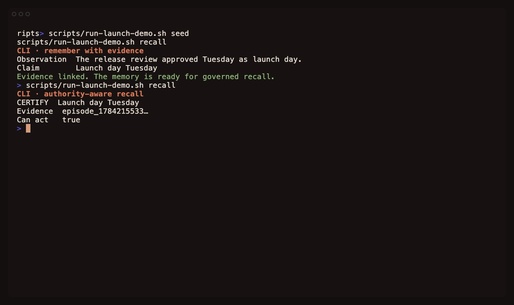
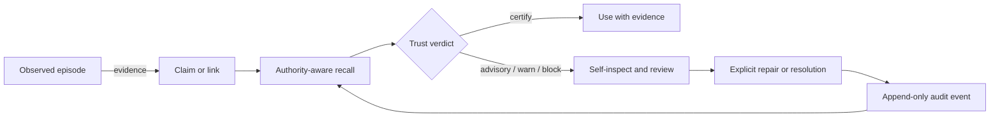

# Nahuali

**Memory for AI agents that can show why a recalled fact should or should not be trusted.**

<p>
  <a href="https://github.com/Arakiss/nahuali/actions/workflows/ci.yml"></a>
  <a href="https://github.com/Arakiss/nahuali/releases"></a>
  <a href="LICENSE"></a>
</p>

<p align="center">
  
</p>

Most agent memory is built to retrieve more relevant context. Nahuali asks a
second question before the agent acts: **should this memory be trusted?**

Nahuali records observations, derived claims, links, procedures, and intentions
in an append-only ledger. Authority-aware recall returns the evidence and a
trust verdict for each result. Self-inspection finds unsupported, stale, or
contradictory claims and turns them into explicit review work without silently
rewriting memory. Default builds also hash-chain the ledger and support
operator-held Ed25519 checkpoints, so historical edits are detectable.

Nahuali is a public beta. It is local software, not a hosted memory service, and
its APIs may still change before 1.0.

## See the difference

Install the signed beta binaries for macOS or Linux, add them to the current
shell, and run the zero-setup demo:

```bash
curl -fsSL https://raw.githubusercontent.com/Arakiss/nahuali/main/scripts/install.sh | sh
export PATH="$HOME/.nahuali/bin:$PATH"
nahuali demo
```

The demo needs no Docker, database, model, API key, or network access after
installation. It runs the production recall and self-inspection policy against
an in-memory projection, then tampers with a real event ledger:

```text
1 · Recall returns evidence and a verdict.
    CERTIFY  Lena owns release notes
             evidence: episode_release_notes   can trust: yes
    WARN     Mateo owns deployment keys
             evidence: none   can trust: no

2 · The store inspects itself before anything is repaired.
    unsupported claims: 1   contradictions: 1   review required: yes
    overall authority: BLOCK   automatic write-back: no

5 · An attacker rewrites event 2 and recomputes its checksum.
    per-event checksum still valid: yes
    the chain catches it: broken link at record 3 (seq 3).

6 · The attacker re-chains the whole history to repair every link.
    chain now reports intact: yes   but the tip changed
    the signed receipt still refuses: verifies = no
```

The demo projects one real in-memory event ledger, then runs the same core
recall and self-inspection policy used by the CLI, MCP server, and HTTP API.
Tests keep that end-to-end story executable.

## What Nahuali adds to memory

| Failure mode | What Nahuali does |
|---|---|
| A relevant claim has no source | Returns it with `warn` or `block`, not as a trusted fact |
| A store mixes good and weak memory | Gives each result its own verdict and reports overall store authority separately |
| Claims disagree or become stale | `self-inspect` reports the affected records and proposes review work |
| An agent proposes a repair | Validates evidence and risk before appending an explicit repair event |
| A historical record is edited | The default hash chain breaks at the next record |
| The entire suffix is rewritten and re-chained | A previously signed operator checkpoint no longer verifies |

The trust modes are deterministic:

- `certify`: the available checks support using this result.
- `advisory`: useful as a lead, but not safe to state without qualification.
- `warn`: evidence or health problems require verification.
- `block`: the result should not drive action until the conflict is resolved.

These verdicts do **not** prove that remembered content is true. They make the
basis for trust inspectable: evidence presence, provenance, confidence,
freshness, contradictions, and ledger integrity. See the full
[trust model](TRUST_MODEL.md) for the exact guarantees and limits.

## Use Nahuali with persistent memory

The demo is self-contained. Persistent memory uses SurrealDB as the
authoritative ledger. Qdrant is optional and only needed for semantic recall.

```bash
git clone https://github.com/Arakiss/nahuali.git
cd nahuali
docker compose up -d

nahuali --database nahuali_demo remember \
  "Lena owns the release notes." \
  --tag product \
  --mention Lena

nahuali --database nahuali_demo claim \
  Lena owns "release notes" \
  --confidence 0.92 \
  --source-last

nahuali --database nahuali_demo recall \
  "Lena release notes" \
  --authority \
  --json

nahuali --database nahuali_demo self-inspect --json
nahuali --database nahuali_demo trust-report --json
```

Database values are SurrealDB identifiers, not paths. Use letters, numbers, and
underscores, for example `nahuali_demo` or `project_alpha`.

To connect an agent harness, run:

```bash
nahuali init
```

`init` installs the bundled Claude Code skill when that harness is present and
prints a valid MCP configuration. Other MCP clients can follow the
[MCP onboarding guide](crates/nahuali-mcp/ONBOARDING.md).

## How the trust loop works



1. **Record observations.** Episodes are what happened. They are the evidence
   that later claims and links cite.
2. **Recall with authority.** MCP and HTTP recall always include result trust.
   The CLI exposes the same contract with `recall --authority --json`.
3. **Inspect before repairing.** `inspect`, `self-inspect`, and `review` are
   non-mutating. They identify problems and proposed work.
4. **Keep changes explicit.** Governed repair validates proposals and appends an
   audited event. Contradictions are never silently overwritten.
5. **Verify the history.** Default builds validate the hash chain on open.
   Operators can sign a chain tip and keep the receipt outside the store.

The deterministic core never calls an LLM. An LLM may propose a repair, but the
engine classifies, gates, and records it. The rules are documented in the
[Self-Repair Contract](SELF_REPAIR.md).

## Interfaces

| Interface | Use it for | Documentation |
|---|---|---|
| `nahuali` CLI | Canonical local workflow for agents, operators, audits, backup, and migration | [CLI reference](crates/nahuali-cli/README.md) |
| `nahuali-mcp` | Structured tools and resources for MCP-aware agent hosts | [MCP onboarding](crates/nahuali-mcp/ONBOARDING.md) · [server reference](crates/nahuali-mcp/README.md) |
| `nahuali-api` | Local HTTP integrations with an OpenAPI contract | [HTTP API](crates/nahuali-api/README.md) · [OpenAPI](crates/nahuali-api/openapi.json) |
| `nahuali-core` | The deterministic Rust engine and public data contracts | [Core contract](crates/nahuali-core/README.md) |

The HTTP API is local and unauthenticated. Do not expose it to an untrusted
network. Nahuali does not currently provide accounts, tenants, hosted sync,
billing, or a managed control plane.

## Storage and recovery

SurrealDB's `memory_record` table is the source of truth. Current memory, graph
tables, snapshots, and semantic vectors are projections or maintenance
artifacts that must be rebuildable from that ledger.

- SurrealDB stores the authoritative append-only record ledger.
- The Rust engine validates and projects that ledger into current state.
- SurrealDB graph tables are derived and rebuildable.
- Qdrant is a derived semantic index and is optional.
- `reconcile` re-verifies the ledger and rebuilds derived tiers.
- Backup and restore operate on the record ledger, not on disposable vectors.

Operational commands and recovery behavior are covered in the
[CLI reference](crates/nahuali-cli/README.md).

## Evidence behind the claims

Nahuali ships reproducible governance fixtures alongside ordinary unit and
integration tests. The fixtures measure different failure classes instead of
collapsing them into one marketing score.

| Check | What it exercises | Current fixture result |
|---|---|---|
| Ledger Integrity Verification Rate | checksum-only, hash-chain, and signed-checkpoint tampering | `0.22`, `0.78`, `1.00` by detector tier |
| Provenance Coverage Rate | assertional memory that can be traced to an episode | `0.75` on the labeled fixture |
| Contradiction and Staleness Detection | seeded contradictions, supersessions, and stale facts | all six seeded defects detected; clean control stays clean |
| Trust Verdict Soundness | `certify`, `advisory`, `warn`, and `block` calibration | all labeled stores receive the expected verdict |

Read [Governance Benchmark Methodology](GOVERNANCE_BENCHMARKS.md) for the
corpora, formulas, commands, and limitations. The dated prior-art review lives
in [Agent-Memory Governance Landscape](MEMORY_GOVERNANCE_LANDSCAPE.md); it is
kept separate because competitive claims age faster than the product contract.

## When Nahuali is a good fit

Use Nahuali when an agent's memory influences decisions and you need to answer:

- What evidence supports this recalled claim?
- Is the information stale, contradictory, or unsupported?
- Did inspection or repair change memory automatically?
- Can I show what was appended since a trusted checkpoint?
- Can I detect if recorded history was rewritten?

Nahuali is probably not the right choice if your only goal is the highest raw
recall score, you need a hosted service today, or you want the engine to rewrite
memory without review. Recall-first systems have broader integrations and more
published accuracy benchmarks. Nahuali focuses on the trust and governance
layer that those systems can also integrate with.

## Beta status and limits

- The project is pre-1.0 and releases are published as betas.
- Persistent use requires a local or self-managed SurrealDB service.
- Qdrant and stronger local model2vec embeddings are optional.
- Self-inspection proposes work but never writes automatically.
- Evidence proves traceability, not factual truth.
- A signed checkpoint proves the ledger matches that receipt. The operator must
  retain the latest trusted receipt to detect rollback or a full re-chain.
- Scope labels separate memory contexts but are not access-control boundaries.
- The local HTTP API has no authentication layer.

See [BETA.md](BETA.md) for the testing boundary and data-safety rules. Before
asking another technical user to test a checkout, run:

```bash
bash scripts/verify-controlled-beta.sh
```

Repository maintainers can also verify the required GitHub Actions permissions:

```bash
NAHUALI_VERIFY_GITHUB_SETTINGS=1 bash scripts/security-supply-chain-check.sh
```

## Documentation

- [Trust model and tamper evidence](TRUST_MODEL.md)
- [Release installation and verification](RELEASE_VERIFICATION.md)
- [Governance benchmark methodology](GOVERNANCE_BENCHMARKS.md)
- [Agent-memory governance landscape](MEMORY_GOVERNANCE_LANDSCAPE.md)
- [Self-repair contract](SELF_REPAIR.md)
- [Roadmap](ROADMAP.md)
- [Beta testing contract](BETA.md)
- [Security policy](SECURITY.md)
- [Compliance notes](compliance/README.md)
- [Contributing](CONTRIBUTING.md)

## Build from source

```bash
docker compose up -d
cargo build --workspace
cargo test --workspace
cargo install --path crates/nahuali-cli --locked
cargo install --path crates/nahuali-mcp --locked
cargo install --path crates/nahuali-api --locked
```

Default builds include tamper evidence and attestation. Use
`--no-default-features` only when you deliberately need the legacy unchained
compatibility build.

## License

Nahuali uses the [Functional Source License 1.1 with an MIT future grant](LICENSE).
Each release converts to MIT two years after its release date.
