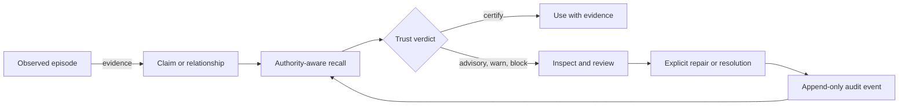

# Nahuali

**Memory an agent can inspect before it trusts.** Nahuali stores observations,
claims, relationships, procedures, and intentions with their evidence, then
returns a deterministic trust verdict with every recall.

<p align="center">
  <a href="https://github.com/Arakiss/nahuali/actions/workflows/ci.yml"></a>
  <a href="https://codecov.io/gh/Arakiss/nahuali"></a>
  <a href="https://github.com/Arakiss/nahuali/releases"></a>
  <a href="LICENSE"></a>
  <a href="Cargo.toml"></a>
  
  <a href="https://registry.modelcontextprotocol.io/v0.1/servers?search=io.github.Arakiss%2Fnahuali"></a>
  <a href="RELEASE_VERIFICATION.md"></a>
</p>

<p align="center">
  
</p>

<p align="center"><sub>A real disposable-store run of <code>nahuali explore</code>: the nahual appears in the empty state, a sourced claim reaches <code>CERTIFY</code>, and a competing claim with no source changes the store to <code>BLOCK</code>. Rebuild the capture with <code>scripts/render-readme-tui-gif.sh</code>.</sub></p>

Most memory systems answer: *what context looks relevant?* Nahuali also asks:
*what supports it, what conflicts with it, and is it safe for an agent to use?*
The authoritative ledger is local-first, append-only, hash chained, and usable
without a model, account, API key, Docker, or hosted service.

## Quickstart

Install the signed macOS or Linux binaries:

```bash
curl -fsSL https://raw.githubusercontent.com/Arakiss/nahuali/main/scripts/install.sh | sh
export PATH="$HOME/.nahuali/bin:$PATH"
```

Create an observation, derive a claim from it, and recall it with evidence:

```bash
nahuali remember "Lena owns the release notes" --mention Lena --tag product
nahuali claim Lena owns "release notes" --source-last --confidence 0.92
nahuali recall "Who owns the release notes?" --authority --require-evidence
nahuali explore
```

Run `nahuali demo` for a narrated, non-mutating explanation of the hash chain
and signed checkpoint.

The default store lives under `~/.nahuali/data` and survives process restarts.
After upgrading, restart applications that keep `nahuali-mcp` running so every
process opens the embedded store with the same engine version.

## What Nahuali gives an agent

- **Evidence-backed memory.** Claims and relationships can point to the episode
  that supports them; recall can require that evidence.
- **A verdict per result.** `certify`, `advisory`, `warn`, and `block` are derived
  from evidence, freshness, conflicts, scope, and ledger integrity.
- **History that resists silent rewriting.** The ledger uses checksums, a hash
  chain, Merkle roots, and optional Ed25519 signed checkpoints.
- **Review instead of hidden mutation.** Self-inspection finds unsupported,
  stale, contradictory, and isolated memory without rewriting it.
- **Rebuildable derived data.** The graph and optional semantic vectors are
  checked against the ledger and can be rebuilt after drift or restore.
- **Interfaces for humans and agents.** The same engine powers the CLI, TUI,
  stdio MCP server, local HTTP API, and Rust crate.

## Trust is explicit

| Verdict | Meaning |
|---|---|
| `certify` | Available checks support using the result with its evidence. |
| `advisory` | Useful as a lead, but not safe to repeat without qualification. |
| `warn` | Evidence or health problems require verification. |
| `block` | The result must not drive action until the conflict is resolved. |

A verdict does not prove that remembered content is true. It makes the reason
for trust inspectable and refuses to hide contradictory or unsupported memory.
See the full [trust model](TRUST_MODEL.md).



The deterministic core never calls an LLM. A model may propose a repair, but
Nahuali validates the evidence, applies the governance rules, and records the
decision as a new event.

## Use it from an agent

Run `nahuali init` to install the bundled skill where supported and print a
native-binary MCP configuration. The server is also published as
`io.github.Arakiss/nahuali` in the official MCP Registry and as an OCI image:

```json
{
  "mcpServers": {
    "nahuali": {
      "command": "docker",
      "args": [
        "run", "--rm", "-i",
        "-v", "nahuali-data:/data",
        "ghcr.io/arakiss/nahuali-mcp:latest"
      ]
    }
  }
}
```

The named volume preserves memory across container restarts. See
[MCP onboarding](crates/nahuali-mcp/ONBOARDING.md) for native and container
configurations.

| Interface | Use it for | Reference |
|---|---|---|
| `nahuali` | Capture, recall, inspection, review, backup, migration, and the TUI | [CLI](crates/nahuali-cli/README.md) |
| `nahuali-mcp` | Structured tools and resources for MCP clients | [MCP](crates/nahuali-mcp/README.md) |
| `nahuali-api` | Local HTTP integrations with an OpenAPI contract | [HTTP API](crates/nahuali-api/README.md) |
| `nahuali-core` | Embedding the deterministic Rust engine | [Core](crates/nahuali-core/README.md) |

The HTTP API is unauthenticated and must not be exposed to an untrusted
network. `/v1/health` reports process liveness; `/v1/ready` verifies the ledger
and graph and can require an exact, current semantic index.

## Storage and recovery

SurrealDB's `memory_record` table is the source of truth. The current-memory
view, graph tables, snapshots, and semantic vectors are derived and rebuildable.

- Embedded SurrealKV is the zero-service default.
- A remote SurrealDB endpoint supports shared deployments.
- Qdrant is optional and used only for semantic recall.
- Lexical recall works without Qdrant or an embedding model.
- `projection-validate` and `semantic-status` detect derived-data drift.
- Restore rebuilds and validates the graph; `--rebuild-semantic` can also return
  the semantic tier ready to serve.

The embedded store has one process owner. A second local process fails clearly
instead of waiting or risking concurrent writes. Use remote SurrealDB when
independent processes must share the same memory.

## Reproducible evidence

The checked-in [governance benchmark suite](GOVERNANCE_BENCHMARKS.md) covers
provenance, contradiction and staleness detection, verdict calibration, ledger
tampering, and signed-checkpoint recovery. The vendor-neutral
[Agent Memory Trust Benchmark](benchmarks/agent-memory-trust/README.md) keeps
unsupported controls and failures visible instead of collapsing them into one
marketing score.

The first-party [retrieval benchmark](benchmarks/agent-memory-retrieval/README.md)
runs the released CLI against a versioned 24-memory, 12-query corpus:

| Mode | Recall@1 | Recall@3 | MRR | nDCG@10 | Median | p95 |
|---|---:|---:|---:|---:|---:|---:|
| Lexical | 1.000 | 1.000 | 1.000 | 1.000 | 33.8 ms | 55.0 ms |
| Deterministic hybrid | 1.000 | 1.000 | 1.000 | 1.000 | 39.0 ms | 40.9 ms |

This small corpus is a regression gate, not a state-of-the-art claim or a
substitute for LoCoMo or LongMemEval. The published
[result](benchmarks/agent-memory-retrieval/results/nahuali-0.8.0-beta.6.json)
is bound to the corpus digest, binary SHA-256, and source revision and includes
every ranked item and latency sample.

Release validation also exercises exact semantic freshness, 1,000- and
10,000-event refresh budgets, restore readiness, signed installation, and a
real N-1 binary writing a ledger that the current release must open, extend,
back up, and restore. Generate a self-contained audit receipt with:

```bash
nahuali trust-report --attestation --output trust-report.html
```

The checked-in [sample receipt](examples/sample-trust-report.html) is generated
from synthetic data and can be inspected offline.

Run the complete release gate with `bash scripts/verify-controlled-beta.sh`.
Maintainers can also verify the required GitHub repository settings with
`NAHUALI_VERIFY_GITHUB_SETTINGS=1 bash scripts/security-supply-chain-check.sh`.

## Beta limits

- APIs and storage behavior may still change before 1.0.
- Self-inspection proposes work but never writes automatically.
- Evidence proves traceability, not factual truth.
- Detecting rollback or a fully re-chained history requires retaining a trusted
  signed checkpoint.
- Scope labels separate memory contexts but are not access-control boundaries.
- Semantic recall requires optional Qdrant; the default lexical path does not.
- Nahuali does not yet provide accounts, hosted sync, billing, or a managed
  control plane.

Read [BETA.md](BETA.md) before using irreplaceable data.

## Build from source

```bash
cargo build --workspace
cargo test --workspace
cargo install --path crates/nahuali-cli --locked
cargo install --path crates/nahuali-mcp --locked
cargo install --path crates/nahuali-api --locked
```

Docker is only needed for the optional remote development stack and Qdrant:

```bash
docker compose up -d
```

## Documentation

- [Trust model](TRUST_MODEL.md)
- [Release verification](RELEASE_VERIFICATION.md)
- [Self-repair contract](SELF_REPAIR.md)
- [Governance benchmarks](GOVERNANCE_BENCHMARKS.md)
- [Security policy](SECURITY.md)
- [Contributing](CONTRIBUTING.md)

Questions and design feedback belong in
[GitHub Discussions](https://github.com/Arakiss/nahuali/discussions). Bugs and
benchmark contributions have structured [issue templates](https://github.com/Arakiss/nahuali/issues/new/choose).

## License

Nahuali uses the [Functional Source License 1.1 with an MIT future grant](LICENSE).
Each release converts to MIT two years after its release date.
